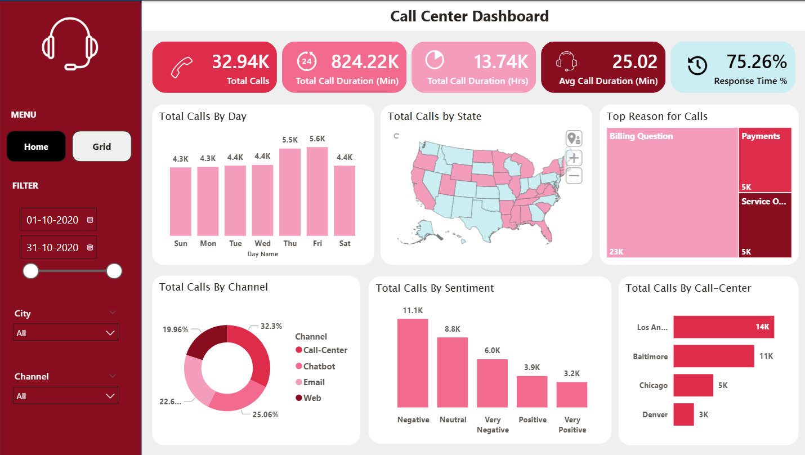
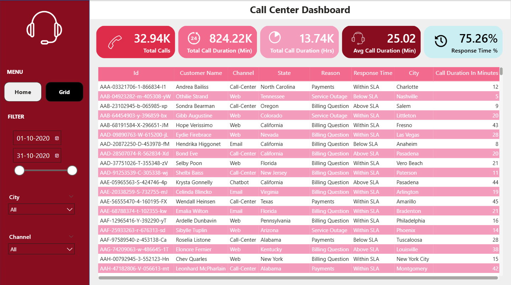

# 📞 Call Center Dashboard | Power BI Project

## 📌 Project Overview
This project is an interactive **Call Center Dashboard** built in **Power BI** to analyze call volume, response performance, customer sentiment, reasons for calls, communication channels, and call center performance.

The dashboard helps users quickly understand operational trends, service efficiency, and customer interaction patterns. It is designed to support better decision-making by providing both a high-level summary and a detailed transaction-level view.

### Home Page

This page provides the summary view of the call center performance with KPIs and charts for quick business insights.

### Detailed Grid View

This page provides detailed row-level call records for deeper analysis and validation.

## 🎯 Project Objective
The main objective of this project is to monitor and analyze call center performance across multiple business dimensions such as:

- Total calls handled
- Call duration
- Response time performance
- Customer sentiment
- Call reasons
- Channel contribution
- Call center-wise performance
- State-level distribution of calls

This dashboard makes it easier to identify service bottlenecks, customer behavior trends, and operational improvement opportunities.

## 🛠️ Tools & Technologies Used
- **Power BI** – Dashboard development and data visualization  
- **Power Query** – Data cleaning and transformation  
- **DAX** – KPI calculations and measures  
- **Excel / CSV Dataset** – Source data  

## 📊 Dashboard Features

### 1. Executive KPI Cards
The dashboard includes top KPI cards to provide an instant overview of performance:

- **Total Calls:** 32.94K  
- **Total Call Duration (Min):** 824.22K  
- **Total Call Duration (Hrs):** 13.74K  
- **Average Call Duration:** 25.02 Min  
- **Response Time %:** 75.26%  

These KPIs help track the overall scale and efficiency of call center operations.

### 2. Calls by Day
A column chart shows how total calls are distributed across the days of the week.  
This helps identify peak calling days and demand patterns.

**Insight:** Call volumes are highest on **Thursday and Friday**, while relatively lower on **Sunday and Monday**.

### 3. Calls by State
A map visualization displays the geographic distribution of calls across different states.  
This helps understand which regions generate more customer queries and service demand.

### 4. Top Reasons for Calls
A treemap highlights the most common reasons customers contact the call center.

Major call reasons include:
- **Billing Question**
- **Payments**
- **Service Outage**

**Insight:** Billing-related queries form the largest share of total calls.

### 5. Calls by Channel
A donut chart shows the contribution of different communication channels such as:
- Call-Center
- Chatbot
- Email
- Web

This helps compare customer interaction preferences across channels.

### 6. Calls by Sentiment
A bar chart categorizes calls based on customer sentiment:
- Negative
- Neutral
- Very Negative
- Positive
- Very Positive

**Insight:** Negative and neutral sentiments dominate the dataset, which may indicate customer dissatisfaction or issue-heavy interactions.

### 7. Calls by Call Center
A horizontal bar chart compares call volume across different call centers such as:
- Los Angeles
- Baltimore
- Chicago
- Denver

This helps evaluate location-wise handling volume and operational load.

### 8. Detailed Data Grid View
The second dashboard page provides a detailed tabular view with fields like:
- ID
- Customer Name
- Channel
- State
- Reason
- Response Time
- City
- Call Duration in Minutes

This page supports detailed record-level analysis and drill-down investigation.

## 🔍 Key Insights
- The call center handled **32.94K total calls**
- Total call duration reached **824.22K minutes**
- Average call duration is **25.02 minutes**
- **75.26% response time** indicates overall service responsiveness
- **Billing Questions** are the top reason for customer calls
- **Negative sentiment** calls are higher than positive sentiment calls
- **Los Angeles** handled the highest number of calls among listed call centers
- Call traffic is strongest toward the **end of the workweek**

## ✅ Business Value
This dashboard can help businesses:

- Monitor overall call center performance in one place
- Track service efficiency and response levels
- Identify major customer pain points
- Compare performance across channels and locations
- Detect negative sentiment trends early
- Support operational planning and staffing decisions

## 🧠 Skills Demonstrated
- Data cleaning and transformation using Power Query  
- Data modeling and relationship handling in Power BI  
- DAX measure creation for KPI calculations  
- Interactive dashboard design and layout planning  
- Data visualization using bar charts, donut charts, treemaps, maps, and tables  
- Performance analysis using call volume, response time, and sentiment metrics  
- Business insight generation from operational data  
- Report structuring with summary and detailed view pages  
- Filter and slicer implementation for dynamic analysis  
- Data storytelling through clear and decision-focused visuals  

## 📬 Conclusion
This Call Center Dashboard project shows how raw service data can be transformed into a meaningful and interactive reporting solution using Power BI. The dashboard helps track call activity, response efficiency, customer sentiment, channel usage, and location-wise performance in a simple and visual way. It also supports both high-level monitoring and detailed record-level analysis, making it useful for operational review and business decision-making. Overall, this project highlights practical skills in data analysis, dashboard design, and insight generation.

